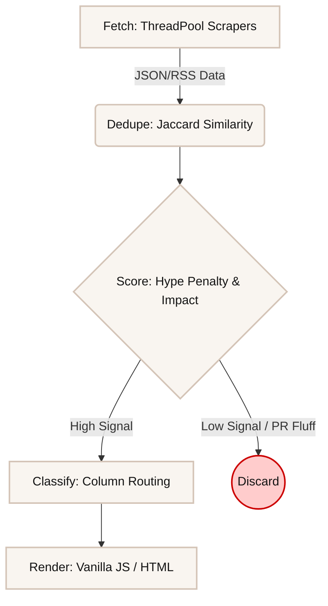

# 📰 The AI Bulletin
> An automated, opinionated AI newspaper. Reads 25+ sources, filters the hype, prints what matters.


[🔗 Live demo](#) · [📐 Architecture](docs/architecture.md) · [💼 LinkedIn writeup](#)

## What it does
The AI Bulletin is a high-signal news aggregator designed like a premium print newspaper. Instead of showing you a noisy, chronological feed of every press release, it scrapes dozens of technical and community sources in parallel, mathematically penalizes clickbait headlines, and groups stories into an editorial layout. It separates engineering updates and research papers from PR announcements so you can quickly see what is actually being built.

## Quick start (see it in 10 seconds)
You can view the fully functioning dashboard instantly—no API keys or database setup required.
```bash
git clone https://github.com/adarsh733/the-ai-bulletin.git
cd the-ai-bulletin
open index.html
```
*(The UI will automatically fallback to reading an inlined JSON sample payload if it detects it's running locally outside the IDE).*

## Run the live scraper
To fetch fresh news, update the cache, and re-run the heuristic scoring pipeline, simply use the provided launcher scripts. This will run the Python scraper and instantly boot up a local server for you to view the live results:

**On Windows:**
```bash
pip install -r requirements.txt
run.bat
```

**On Mac/Linux:**
```bash
pip install -r requirements.txt
chmod +x run.sh
./run.sh
```

## How it works


The pipeline is split into five distinct stages:
1. **Fetch**: A `ThreadPoolExecutor` dispatches concurrent workers to scrape 25+ RSS feeds, subreddits, and curated social profiles. 
2. **Dedupe**: Titles are compared against the active database using a >0.70 Jaccard similarity threshold to filter out duplicate reporting of the same story.
3. **Score**: The script parses summaries for numeric metrics, funding signals, or novel releases to boost impact, and subtracts points for specific clickbait "hype words".
4. **Classify**: Based on the source and vocabulary, the story is sorted into one of three newspaper columns (e.g., *Built & Shipped* vs *The Big Picture*).
5. **Render**: The frontend Vanilla JS reads the emitted JSON payload and paints the aesthetic warm-beige layout without any virtual DOM overhead.

## 🤖 Built with Antigravity & Jetro AI Orchestration
This project wasn't built using a traditional monolithic stack; it was built using advanced agentic orchestration.

* **Antigravity IDE (Vibe Coding):** The entire application logic—from the concurrent ThreadPool Python scraper to the Jaccard deduplication algorithm—was engineered via "vibe coding" inside Google's Antigravity IDE (powered by Claude/Gemini). It allowed for rapid architectural iteration and surgical debugging.
* **Jetro AI (The Orchestration Bridge):** During development, the frontend wasn't served by a traditional REST API or Node.js server. Instead, it ran on Jetro AI's infinite canvas workspace. 
* **The Jetro Connector Pattern:** Instead of writing complex API endpoints, the Python scraper was bound directly to the HTML UI using Jetro. The backend printed a hermetically sealed JSON payload to standard output, which Jetro captured and instantly piped into the frontend via a custom `jet:refresh` DOM event.
* **The Standalone Pivot:** To make this repository open-source and portable for GitHub, I wrote a fallback `fetch()` mechanism in `index.html` and bundled tiny local launcher scripts so anyone can run the app without needing the proprietary Jetro engine.
## What I learned
* **Stdout serialization requires strict discipline.** My IDE bindings expected a single JSON object. A single intermediate `print("loading...")` crashed the pipeline. I learned to hermetically seal `sys.stdout` for the final payload and route all progress tracking explicitly to `sys.stderr`.
* **CORS is ruthless on local files.** You cannot simply `fetch('data.json')` in Javascript if the user opens the HTML file via the `file:///` protocol. To ensure the repo was frictionlessly cloneable, I inlined the sample data payload directly into the HTML `<head>`.
* **Simple heuristics beat complex LLMs for routing.** You don't need a heavy language model to classify clickbait. Counting instances of words like "mind-blowing" and comparing token overlap (Jaccard similarity) between headlines filtered out noise significantly faster and cheaper than an LLM API call.
